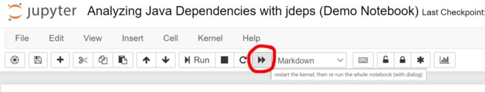

# Software Architecture Summit 2020 Remote Edition

Informationen zum Workshop "Softwaresysteme datengetrieben analysieren"

## Notebooks

* [Präsentation (als Slideshow, zum Durchklicken)](https://nbviewer.jupyter.org/format/slides/github/innoq/sas2020mh/blob/master/presentation/Softwaresysteme%20datengetrieben%20analysieren.ipynb#/)
* [Präsentation (als Notebook, zum Durchscrollen)](https://nbviewer.jupyter.org/github/innoq/sas2020mh/blob/master/presentation/Softwaresysteme%20datengetrieben%20analysieren.ipynb#/)
* [Hands-On Mini-Tutorial, Teil II](https://nbviewer.jupyter.org/github/innoq/sas2020mh/blob/master/tutorial/10%20pandas%20and%20matplotlib%20basics.ipynb)
* [Analyse zu Community-Aktivitäten bei Versionskontrollsystemen](https://nbviewer.jupyter.org/github/innoq/sas2020mh/blob/master/demos/Analyzing%20the%20community%20activity%20for%20version%20control%20systems.ipynb)
* [Auswertung von Performance-Messdaten aus dem Linux-Umfeld](https://nbviewer.jupyter.org/github/innoq/sas2020mh/blob/master/demos/Parsing%20and%20Analysing%20vmstat%20Data%20the%20Easy%20Way%20%28Demo%20Notebook%29.ipynb)
* [Graph-basierte Analyse von Design Smells im Java-Code](https://nbviewer.jupyter.org/github/innoq/sas2020mh/blob/master/demos/Graph-based%20Design%20Smells%20Analysis.ipynb) (funktioniert nicht über Binderhub wegen den restriktiven Port-Freigaben der Plattform)
* [Ideen zum datengetriebenen "Strategic Redesign"](https://nbviewer.jupyter.org/github/innoq/sas2020mh/blob/master/demos/Strategic%20Redesign.ipynb) ([Slideshow-Version](https://nbviewer.jupyter.org/format/slides/github/innoq/sas2020mh/blob/master/demos/Strategic%20Redesign.ipynb))

### Hinweise für das Ausführen

- Dieses Repository kann hier auf einer Online-Datenanalyseplattform ausgeführt werden: 
- Die unten aufgelisteten Jupyter Notebooks können auch einzeln direkt durch den Klick auf das Binder-Symbol ausgeführt werden: 

Die Notebooks selbst können auf der Online-Datenanalyseplattform über den "Run All"-Button ausgeführt werden:

## Links

* [Meine TOP 5 Empfehlungen für den Einstieg in diverse Themen (u. a. rund um Software Analytics)](https://www.feststelltaste.de/category/top5/)
* [Eine Sammlung an nützlichen Informationen zu Software Analytics (Paper, Bücher, Online-Kurse etc.)](<https://github.com/feststelltaste/awesome-software-analytics/>)

## Eigene Installation

* [Anleitung zum Installieren der Datenanalyse-Werkzeuge auf den eigenen Rechner](https://www.feststelltaste.de/saw/)

## Mehr Workshop

* [Software Analytics Workshop (2 Tage)](https://www.feststelltaste.de/software-analytics-workshop/)
